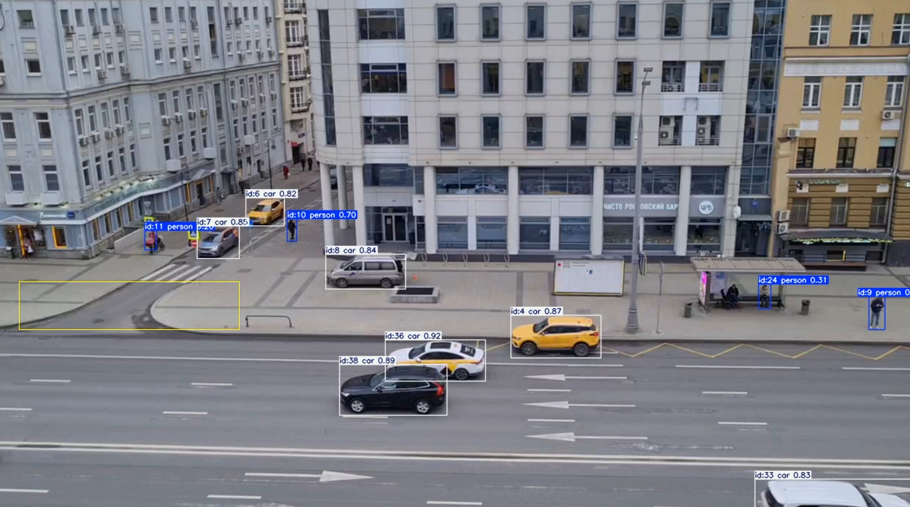

# Traffic Counter с YOLO и OpenCV

Скрипт для подсчёта автомобилей в видеоролике с помощью модели YOLO (ultralytics) и OpenCV.



## Возможности

- Проигрывает видео и позволяет **интерактивно выбрать область интереса (ROI)** мышкой.
- Использует `YOLO` для **детекции и трекинга** объектов.
- Считает автомобили (класс `car`), **центр которых попадает в выбранную область**.
- Сохраняет новое видео с:
  - нарисованными bounding box’ами,
  - выделенной областью (ROI),
  - текущим счётчиком машин.

---

## Требования

- Python 3.8+
- OpenCV
- Ultralytics YOLO
- NumPy

### Установка зависимостей

```bash
pip install opencv-python ultralytics numpy
````

> ⚠️ Убедитесь, что у вас есть модель `yolo11x.pt` (или другая совместимая с ultralytics YOLO-V8/V11)
> и путь к ней правильно указан в скрипте.

---

## Подготовка

1. Поместите входное видео в файл `input.mp4` (или измените путь в `video_path`).

2. Скачайте и положите веса модели YOLO, например `yolo11x.pt`,
   и укажите путь к ним в переменной:

   ```python
   model_path = "yolo11x.pt"
   ```

3. При необходимости измените имя выходного видео:

   ```python
   output_path = "out_counted.mp4"
   ```

4. При желании можно настроить кадр по умолчанию, на котором будет пауза
   для выбора области, если пользователь сам не нажал пробел:

   ```python
   DEFAULT_SELECT_FRAME = 100
   ```

---

## Запуск

```bash
python main.py
```

---

## Управление

### Фаза 1 — просмотр видео и выбор ROI

* Видео проигрывается с начала.
* В левом верхнем углу отображается подсказка:
  `Пробел - определить область`.

**Доступные действия:**

* `Пробел` или клавиша `P` — остановить видео и перейти к выбору области.
* Если ничего не нажимать, скрипт автоматически перейдёт к выбору ROI на кадре
  `DEFAULT_SELECT_FRAME`.

### Выбор области (ROI)

После паузы:

1. Нажмите и удерживайте **левую кнопку мыши** в одном углу прямоугольника.
2. Потяните мышь до противоположного угла.
3. Отпустите кнопку — прямоугольник зафиксируется.

Далее:

* `Enter`, `Пробел` или `S` — подтвердить выбор области и перейти к подсчёту.
* `Esc` — отменить выбор и завершить работу скрипта.

---

## Фаза 2 — трекинг и подсчёт машин

После выбора ROI:

* Скрипт продолжает обработку видео (начиная с кадра, где была сделана пауза).
* YOLO детектирует объекты и назначает им ID трека.
* Для каждого объекта класса `car` вычисляется центр bounding box’а.
* Если центр впервые попадает внутрь выделенной области, счётчик машин увеличивается на 1.
* На кадр накладывается:

  * Область ROI (желтым контуром),
  * Боксы и подписи YOLO,
  * Текст: `Машины с Патриков: N`.

**Управление:**

* `Esc` — остановить обработку и выйти.

---

## Файлы

* **`main.py`** — основной скрипт с выбором ROI, трекингом и подсчётом.
* **`input.mp4`** — входное видео (не входит в репозиторий).
* **`out_counted.mp4`** — выходное видео с аннотацией и счётчиком.
* **`yolo11x.pt`** — файл весов модели YOLO (не входит в репозиторий).

---

## Как это работает (кратко)

1. **Выбор ROI**
   Используется OpenCV:

   * проигрываем кадры с `VideoCapture`,
   * на кадре-паузе включаем обработчик мыши и рисуем прямоугольник,
   * сохраняем координаты как многоугольник `region_polygon`.

2. **Детекция и трекинг**
   Используется Ultralytics YOLO:

   ```python
   results = model.track(frame, persist=True)
   ```

   * `persist=True` позволяет YOLO сохранять `track_id` между кадрами.
   * В `results[0].boxes` лежат координаты и ID треков.

3. **Подсчёт машин**

   * Для каждого бокса класса `car` берётся центр.
   * Функция `is_point_in_polygon()` (на базе `cv2.pointPolygonTest`) проверяет,
     попал ли центр внутрь ROI.
   * Для каждого `track_id` хранится флаг `has_been_counted[track_id]`.
   * Машина считается **ровно один раз**, когда её центр впервые попадает в область.

---

## Ограничения и идеи для развития

* Сейчас учитываются только объекты класса `car`. Можно добавить:

  * `truck`, `bus` и т.п., просто расширив условие.
* Не учитывается направление движения (сверху вниз, слева направо и т.д.).
  Если нужно считать только машины, пересекающие ROI в определённом направлении,
  можно использовать `track_history` и анализировать изменение координаты `y` по времени.
* ROI всегда прямоугольный. При желании область можно сделать произвольным многоугольником.

---
